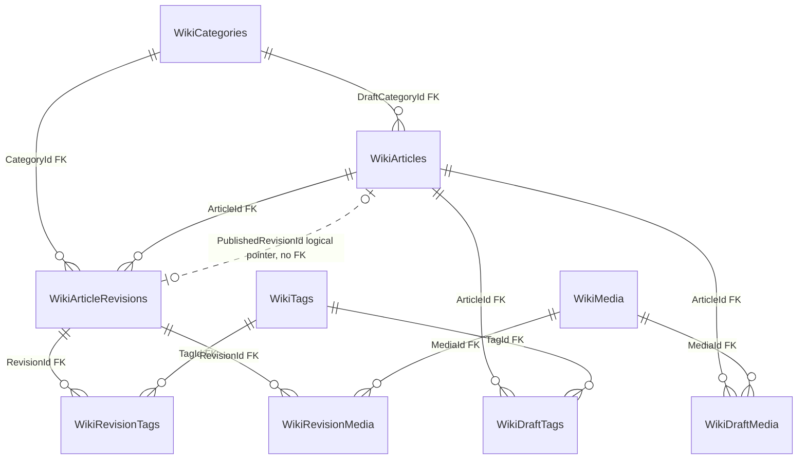
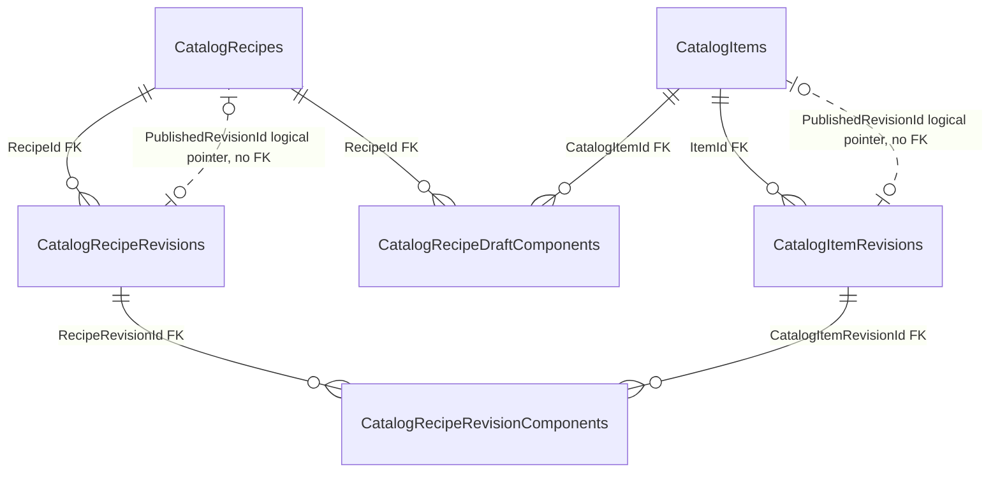
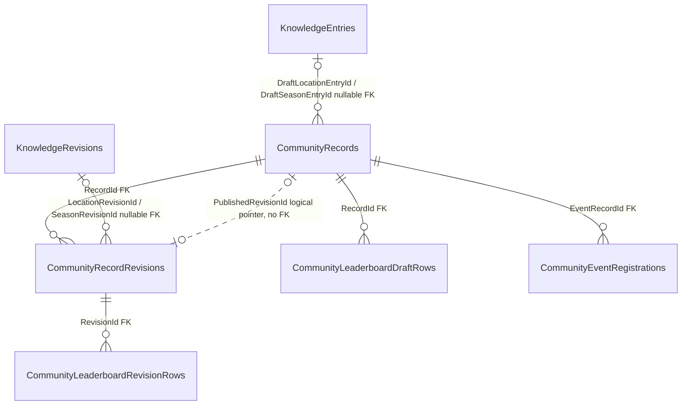
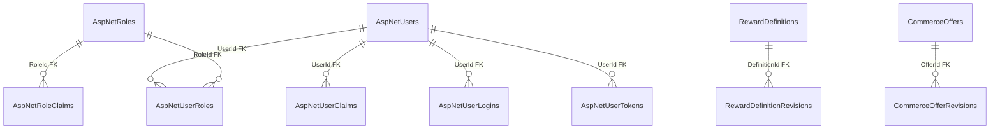

# Nova Haven — Entity Relationship Diagram

This diagram set records the current SQL Server schema represented by `NovaDbContext` and cross-checked against the local database's declared foreign keys. It is a logical ERD: columns unrelated to relationships (editorial fields, timestamps, rowversions and indexes) are omitted for readability.

`||--o{` means one principal row may be referenced by many dependent rows. Dotted arrows labelled “logical pointer” are UUID values in the model, **not database-enforced foreign keys**. They can be temporarily absent or invalid if data is edited outside the application; the API is responsible for maintaining them.

## Wiki editorial, media and history

`WikiAuditEvents` stores entity type/UUID values without foreign keys so audit rows do not constrain editorial deletion/history. `WikiMedia` is an independent storage catalog; associations are through the two join tables above. All declared Wiki history/media joins use restrictive delete behavior. The current published-revision pointer is not a declared FK.

## Catalog and recipe snapshots

Draft recipe components reference mutable catalog items; published recipe components snapshot references to immutable catalog-item revisions. Recipe/item published pointers are logical model fields, not schema FKs.

## Knowledge graph and immutable revisions

```mermaid
erDiagram
    KnowledgeEntries ||--o{ KnowledgeRevisions : "EntryId FK"
    KnowledgeEntries ||--o| KnowledgeNpcProfiles : "EntryId FK"
    KnowledgeEntries o|--o{ KnowledgeNpcProfiles : "LocationEntryId nullable FK"
    KnowledgeRevisions ||--o| KnowledgeNpcProfileRevisions : "RevisionId FK"
    KnowledgeRevisions o|--o{ KnowledgeNpcProfileRevisions : "LocationRevisionId nullable FK"
    KnowledgeEntries ||--o| KnowledgeQuestDefinitions : "EntryId FK"
    KnowledgeEntries o|--o{ KnowledgeQuestDefinitions : "GiverNpcEntryId / LocationEntryId nullable FK"
    KnowledgeRevisions ||--o| KnowledgeQuestDefinitionRevisions : "RevisionId FK"
    KnowledgeRevisions o|--o{ KnowledgeQuestDefinitionRevisions : "GiverNpcRevisionId / LocationRevisionId nullable FK"
    KnowledgeEntries ||--o{ KnowledgeQuestSteps : "QuestEntryId FK"
    KnowledgeRevisions ||--o{ KnowledgeQuestStepRevisions : "QuestRevisionId FK"
    KnowledgeEntries ||--o| KnowledgeWorldLocations : "EntryId FK"
    KnowledgeRevisions ||--o| KnowledgeWorldLocationRevisions : "RevisionId FK"
    KnowledgeEntries ||--o| KnowledgeSeasonDefinitions : "EntryId FK"
    KnowledgeRevisions ||--o| KnowledgeSeasonDefinitionRevisions : "RevisionId FK"
    KnowledgeEntries ||--o{ KnowledgeDraftLinks : "EntryId FK"
    KnowledgeEntries o|--o{ KnowledgeDraftLinks : "TargetEntryId nullable FK"
    CatalogItems ||--o{ KnowledgeDraftLinks : "TargetCatalogItemId FK"
    KnowledgeRevisions ||--o{ KnowledgeRevisionLinks : "RevisionId FK"
    KnowledgeRevisions o|--o{ KnowledgeRevisionLinks : "TargetRevisionId nullable FK"
    CatalogItemRevisions ||--o{ KnowledgeRevisionLinks : "TargetCatalogItemRevisionId FK"
    KnowledgeRevisions o|..o| KnowledgeEntries : "PublishedRevisionId logical pointer, no FK"
```

The `KnowledgeNpcProfiles`, `KnowledgeQuestDefinitions`, `KnowledgeWorldLocations` and `KnowledgeSeasonDefinitions` rows extend a knowledge entry; their revision counterparts extend a `KnowledgeRevisions` row. Optional relationships are labelled nullable and use `o|` on the dependent side; required subtype/base relationships use `||`. Where two optional columns in one table target the same principal, the ERD combines them in one labelled line; each column is still a separately declared FK. All these constraints are restrictive.

## Community and cross-module snapshots

`CommunityLeaderboardRevisionRows` are tied to a published community revision, while draft rows are tied to the mutable record. Event registrations point to the event record. Registrations currently store contact data and should be populated only with consent-appropriate demo values.

## Identity and standalone tables

`NewsPosts`, `IntegrationCapabilities`, `WikiAuditEvents` and `WikiMedia` have no declared foreign keys in the current model. Identity user references such as `PublishedBy` are UUID values in content tables; they are not database FKs. The current M7 boundary intentionally has no Minecraft plugin database tables or write path.

## Source and verification boundary

- Entity/table and FK configuration: `backend/NovaHaven.Infrastructure/Data/NovaDbContext.cs` and its migrations/model snapshot.
- Live FK check: read-only SQL Server metadata inventory against local `NovaHaven_Local`; no content rows were read or changed for this diagram.
- Do not treat dotted published-revision pointers or audit/publisher UUIDs as relational constraints.
- Before applying future migrations, update these diagrams from the migration/model and verify FK changes on a disposable local database.
